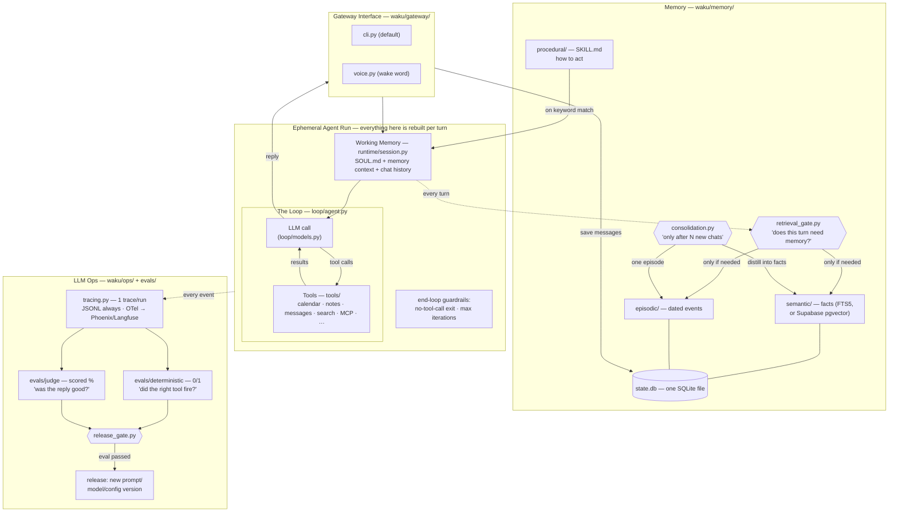
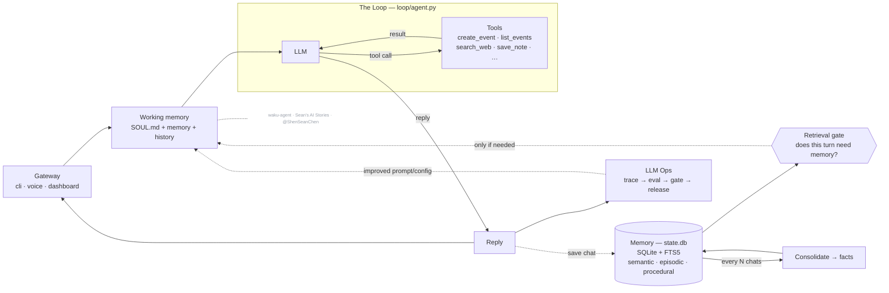

# Architecture — the whiteboard, refreshed

The same system as the two whiteboard diagrams from the previous videos
(the generic Harness/Loop/Memory/LLM-Ops one and the Hermes-specific one),
now with a file path on every box.

## The short version

> _Architecture of **waku-agent** — built on the series
> ([@ShenSeanChen](https://github.com/ShenSeanChen)). Code is MIT; **this diagram is licensed CC BY-NC-SA 4.0** —
> reuse it with credit to the channel, not for commercial resale._

### MEMORY.md vs state.db

Some assistants (e.g. Hermes) keep long-term memory as a single `MEMORY.md`
markdown file. Waku keeps the *queryable* source in `state.db` (the `facts` and
`episodes` tables, keyword-searchable via FTS5) **and** regenerates a readable
`.waku/MEMORY.md` mirror after every turn — so you get both: a real file you
can open, backed by a sturdy database. The dashboard's **Memory** tab is the
friendly view; the **Data** tab shows the raw `state.db` tables.

## Which file is which

- `waku/gateway/` — how text gets in and out: `cli.py`, `voice.py` (wake word)
  and `ops/dashboard.py`. Gateways only move text.
- `waku/runtime/session.py` — working memory for one turn: SOUL.md, memory
  context and chat history.
- `waku/loop/agent.py` — the loop. `loop/models.py` — pluggable providers over
  two wire formats.
- `waku/graph/` — the engine, node factories and `workflows/` (triage): opt-in
  structure around the loop. The loop never changes, a graph node can be a loop
  turn, and every failure fails open to the plain loop.
- `waku/tools/` — what the agent can call: `calendar.py`, `google_calendar.py`,
  `notes.py`, `messages.py`, `search.py`, `github.py`,
  `workspace.py`, `memory_admin.py`, the MCP client and `experimental.py`.
  `registry.py` decides which are on.
- `waku/memory/` — semantic (FTS5), episodic and procedural (SKILL.md) memory,
  plus `retrieval_gate.py` (hero 1: does this turn need memory?) and
  `consolidation.py` (every N exchanges).
- `waku/ops/` — tracing (JSONL + OTel), the dashboard (localhost:7777),
  `release_gate.py`, and `compare_history.py` (the Compare arena's own JSONL
  scoreboard, never `state.db`).
- `waku/ops/static/` — the dashboard frontend. Read
  [context/design-system.md](context/design-system.md) before changing how
  anything looks.
- `evals/deterministic/` (0/1, pytest) and `evals/judge/` (DeepEval, scored).
  The two never mix.
- `examples/` — teaching material, not product; one folder per topic.
- `.waku/` — runtime state: `state.db`, `calendar.ics`, `outbox/`, `traces/`.
  Gitignored.

## Design decisions worth stealing

- **The gate before retrieval** (not retrieval on every turn): a cheap-model judge
  answers "does this message need the user's memory?" — saves latency and, more
  importantly, keeps irrelevant memories from biasing answers.
- **Consolidation is batched** ("after N chats"), asynchronous to the reply path,
  and loss-safe: if the summarizer fails, the chat log stays unconsolidated.
- **Deterministic evals and judge evals never mix.** One is a unit test, the other
  is a scored opinion. The release gate requires 100% of the first and a threshold
  on the second.
- **Every layer has a boring default and a documented upgrade** — FTS5 → pgvector,
  mock calendar → Google Calendar, JSONL → Phoenix/Langfuse. The default is always
  zero-signup.
- **Graphs wrap the loop, never replace it.** When a turn needs shape (parallel
  steps, explicit routing), an opt-in graph workflow (`waku/graph/`) arranges nodes
  around the untouched loop — the `full_agent` node IS `run_loop`. Routers are plain
  code reading state a model wrote; every failure fails open to the plain loop; the
  dashboard renders the topology from the engine's own `describe()` so the picture
  can't drift. See `docs/agent-graphs-design.md`.

## What this deliberately is not

Not a framework, not multi-agent, not production. (Still not multi-agent even with
graph workflows: a graph's `agent_node` is the same loop invoked as one step — no
peer-to-peer agent messaging, execution follows the edges deterministically.) It's
the readable blueprint — OpenClaw and Hermes are the products; this is the afternoon
read that explains them.
