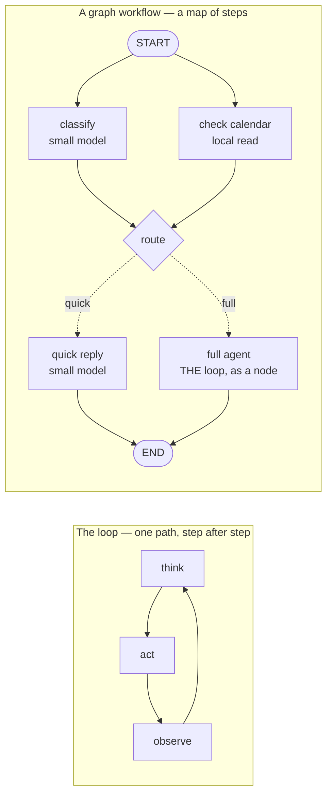

# The tour

What Waku does, pillar by pillar, and where to watch each one run. Start the
dashboard first:

```bash
waku dashboard          # starts a local server → http://localhost:7777
```

## The dashboard

A small web server you own (`127.0.0.1`, no cloud). The browser is just the UI —
the same process runs every turn. This is the fastest way to *get* the system.

A chat dock sits on every tab. Type or **speak**, and watch it flow through the
harness on the Overview diagram: gate lights up → loop calls a tool → reply comes
back → memory updates. The frontend is plain static files. No build step.

Each tab is one pillar, linked to the real files:

| Tab | What you see |
|---|---|
| **Overview** | cost, latency, the gate skip/retrieve split, the clickable architecture map |
| **Gateway** | one conversation across every channel, each message tagged by source (dashboard / telegram / voice / cli) |
| **Loop** | every turn with its gate decision, tool calls, tokens, and cost |
| **Graph** | graph workflows: the live triage topology (drawn from the engine itself) + which door each turn took |
| **Memory** | sub-tabs per pillar — semantic facts, episodes, editable skills + SOUL, consolidation |
| **Tools** | the agent's available tools (grouped by origin), its results, and MCP connectors |
| **Data** | a live SQLite browser: per-table tabs, schema, and a read-only SQL console over `state.db` |
| **Ops** | eval verdict + history, the gate decisions, slowest turns, and inline JSONL traces |

The sidebar and chat dock are drag-resizable and hideable, and the chat has
*New chat* + history like any chat app.

## Things to try

Type these in the chat dock (or `make run`) and watch the dashboard light up:

| Try this | What it shows | Where to watch |
|---|---|---|
| *"Schedule a tennis game with Raj this Saturday at 8am"* | the Loop calls a tool (`create_event`) | the **LOOP** box pulses; **Loop** tab shows `iter 2` |
| *"What's on my calendar today?"* | reading the calendar (`list_events`) | it answers from `state.db`, no made-up events |
| *"When am I swimming with Sergey?"* then *"what's 12 × 8?"* | the **retrieval gate** — retrieve vs skip | Overview gate bar; **Ops** shows the per-turn decision |
| *"Remember that Raj prefers evening games"* | memory self-management (`save_note`) | **Memory ▸ Semantic** gains a fact; `MEMORY.md` updates |
| *"Search for the World Cup games still left to play and add each one to my calendar"* | **multi-tool loop engineering** | **Loop** tab shows `iter 8`: `search_web` × N → `create_event` × N |
| chat from `make run` **and** the browser | one brain, many gateways | the **Gateway** tab tags each message `cli` / `dashboard` |

The World Cup one is the most striking. In one turn, Waku searches the web a
few times, reasons over the results, and books every remaining match — **8 loop
iterations**, live. It needs a free `TAVILY_API_KEY` (paste it in
**Connections**).

## The loop

Yes, there's a real agent loop, and it's [~95 lines of plain Python](../waku/loop/agent.py) —
no LangGraph, no hidden control flow. When a task needs structure *around* the
loop, that structure is another ~200 readable lines (see
[graph workflows](#graph-workflows) below).

```
while not done:
    response = llm(messages, tools)      # reason
    if response wants tools:
        results = run(tool_calls)        # act
        messages += results              # observe
    else:
        done                             # reply to the human
```

Two guardrails end every turn: the model stops asking for tools (natural end),
or it hits `max_iterations` (hard stop — it never spins forever). That's "loop
engineering": the exit conditions, the tool round-trip, and feeding results
back as working memory.

**Watch it yourself:**
1. Type *"schedule a swim with Sergey Saturday at 5pm"* in the chat dock and
   watch the **LOOP** box on the Overview diagram light up: reason →
   `create_event` → reason → reply.
2. Open the **Loop** tab — every turn is listed with its gate decision, each
   tool call, the **iteration count**, tokens, and dollar cost. A tool-using
   turn shows `iter 2` (reason, act, then reason again to reply); a plain answer
   shows `iter 1`.
3. Open the **Ops** tab (or `.waku/traces/<today>.jsonl`) to read that same
   turn as raw events in order: `turn_start → gate → llm → tool → llm → turn_end`.

**The multi-tool loop.** One tool is a loop; *chaining* tools is where loop
engineering earns its name. Try *"Search for the World Cup games still left to
play and add each one to my calendar."* The agent loops across two tools:
[`search_web`](../waku/tools/search.py) reads the web, it reasons over the
results, then calls [`create_event`](../waku/tools/calendar.py) once per match.
You'll see `iter 4`, `iter 5`… on the Loop tab. `search_web` works keyless via
DuckDuckGo, but that endpoint rate-limits bots, so for a clean run set a free
`TAVILY_API_KEY` (see [`.env.example`](../.env.example)).

## Graph workflows

The loop is one agent turn: the model picks tools until it stops, and that
covers chat. But some work has **shape** — steps that could run *at the same
time*, and explicit "if this, go here" routing. A **graph workflow** makes that
shape first-class: nodes (each does one job — a function, one LLM call, or a
whole loop turn) connected by edges (what happens next). It extends the Loop
pillar rather than replacing it: [`loop/agent.py`](../waku/loop/agent.py) did
not change one line, because a graph arranges calls *around* it and *to* it.
The whole engine is [one readable file](../waku/graph/engine.py).



**The shipped example: triage.** Set `WAKU_GRAPH_WORKFLOWS=1` (in `.env`, or
the dashboard's Settings) and *every* message enters the triage graph first —
you never choose a mode, the harness decides. A small model classifies the
message **while** today's calendar loads in parallel; *"thanks!"* gets a fast
small-model reply and never wakes the big model; *"schedule a swim Saturday"*
routes into the exact same loop as before, running as one node. Any failure
anywhere **fails open** to the plain loop, so the flag can only ever save time
and tokens. A graph is *not* a swarm of chatting agents: the edges decide
everything, deterministically, which is why it can be traced and eval'd like
everything else here. The longer argument is in
[loop-vs-graph.md](loop-vs-graph.md).

**Watch it yourself:**
1. Switch the flag on, then send *"thanks!"* — on **Overview**, the graph panel
   lights the quick path while the LOOP boxes stay dark: the big model never woke.
2. Send *"schedule a swim Saturday 9am"* — watch `route → full_agent` light up,
   then the familiar loop animation take over.
3. Open the **Graph** tab: the live topology is drawn from the engine's own
   `describe()`, so the picture cannot drift from the code. The trace
   (`.waku/traces/<today>.jsonl`) shows the run as
   `graph_start → node_start … route → graph_end`.

## The retrieval gate

Most agents hit their memory store on every turn. That's slow, and worse,
irrelevant memories bias answers. Here a cheap model first answers one
question: *does this message need memory at all?* Watch it in the terminal:

```
you > what's 2+2?
  gate · skip — pure math
you > when am I meeting Alex?
  gate · retrieve — references user's plans
```

## It manages its own memory

The agent has tools to keep itself useful — no black box:
- **manage_memory** — correct or forget a fact when you say it's wrong.
- **update_soul** — save a standing preference you give it (lives in `SOUL.md`).
- **create_skill** — when you teach it a repeatable workflow, it offers to save
  it as a skill (written to `.waku/skills/`, live the same session).

You can also edit any of this by hand on the dashboard's Memory tab (edit or
delete facts, rewrite `SOUL.md`) or in Settings (switch provider or model,
paste keys — kept in your local `.env`, never sent to the browser).

Waku keeps the *queryable* memory in `state.db` and regenerates a readable
`.waku/MEMORY.md` after every turn; [architecture.md](architecture.md#memorymd-vs-statedb)
explains why there are two.

## Add skills — yours or the community's

Skills are procedural memory: markdown instructions loaded only when relevant.

```bash
waku skill install https://github.com/<someone>/<repo>/blob/main/skills/<skill>/SKILL.md
waku skill export --to claude,codex     # copy Waku's skills to Claude Code and Codex
```

**Contribute one — it's just a markdown file.** Copy
[`skills/TEMPLATE.md`](../skills/TEMPLATE.md) and send a PR into
[`skills/community/`](../skills/community). CI validates the frontmatter and
checks which messages load it; see [CONTRIBUTING.md](../CONTRIBUTING.md).
